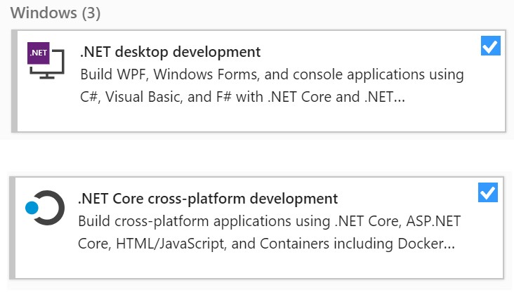
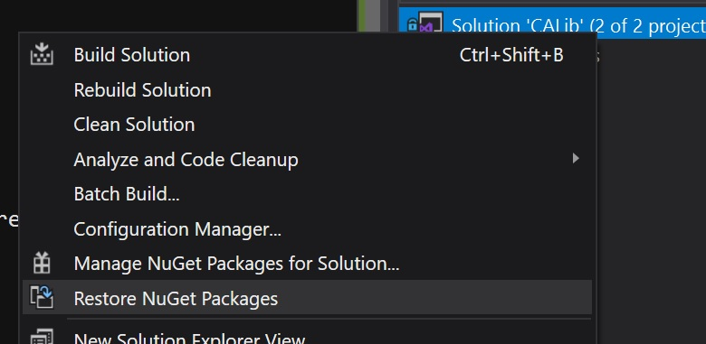
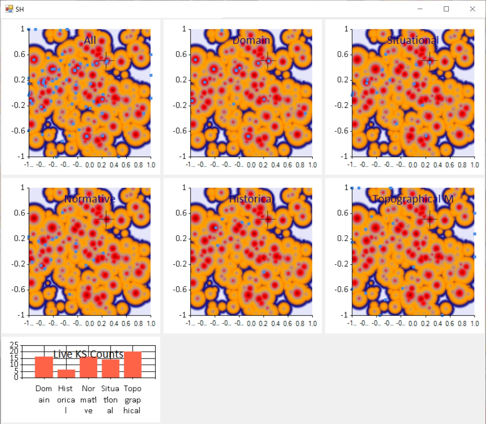

# CALib
Cultural Algorithms optimization framework

## Set up
- Install Visual Studio (VS) 2019 (or later)
- You can get the free community edition from here:  https://visualstudio.microsoft.com/vs/community/
- During setup, select support for **F# language** and **.Net Core**.
The Visual Studio setup utility has 'Workloads' that bundle commonly used features. Select appropriate boxes as shown below to get F# and .Net core installed:

- After VS is installed, open the 'solution' file CALib.sln with Visual Studio

- In the 'Solution Explorer' window right click on the root of the tree and select "Restore NuGet Packages" as shown below:

- After the package load is complete, compile solution to check configuration validity

## Cones World Visualization
Open "ConesWorldVisualization.fsx" script in editor and select all text and hit Alt-Enter to run script

The script should open with animated windows that look like the image below.

## F# Language Resources
Start with https://fsharp.org/ to access the learning resources available for the F# language

## Projects
The solution has two projects:

* CALib - this can be used in two ways:

   1. Compiled to a DLL and linked with a .Net application to solve optimization problems

   2. Interactively with F# interactive (.fsx) script files, for research and experimentation purposes

- CaLibCore - a version of CALib that runs on Linux (with .Net Core). Its main purpose is to conduct experiments on the Wayne State grid computing environment
